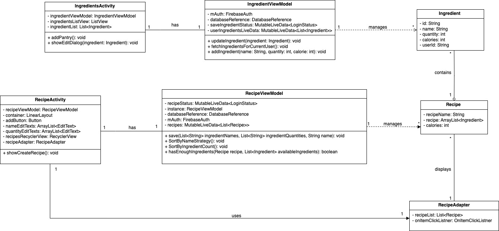

# GreenPlate: A Sustainable Food Management System

## Introduction

Welcome to GreenPlate, an innovative project designed to revolutionize the way we think about and manage our food. At the heart of GreenPlate is our commitment to promoting sustainable food management. This initiative plays a pivotal role in enhancing sustainable eating and shopping habits, empowering users to make eco-friendly choices that benefit both the planet and their health. Through GreenPlate, we aim to reduce food waste and improve food resource management by integrating smart technology and user-friendly interfaces into everyday activities.

## Design & Architecture

The architecture of GreenPlate is built on robust design principles and patterns that ensure scalability, maintainability, and efficiency. Below are the UML diagrams that provide a clear visual representation of the application's design:

- **Design Class Diagrams**: These diagrams detail the structure of our classes, their interrelationships, and how they interact within the system.
  

We utilize a combination of Singleton, Strategy Pattern and Observer patterns to manage object creation and ensure that the system uses resources optimally.

- **Singleton Design Pattern**:
  

- **Strategy Design Pattern**:
Our implementation of sortings align with the principles of the Strategy Pattern. We created a common interface RecipeSortingStrategy and individual classes for each sorting algorithm that implements RecipeSortingStrategy. We created the method setupSortingButtons， and called it within onCreate to initiate all buttons for sorting purposes. The  RecipeViewModel acts as the context, holding a reference to the functional interface that represents the chosen sorting behavior. This is exemplified in the methods in  RecipeViewModel. Sorting methods SortByDefault, SortByNameStrategy, SortByIngredientCount, each configuring the ViewModel to use a different sorting algorithm. This setup allows the sorting behavior to be changed dynamically, and it also ensures loose coupling in the implementation. The RecipeActivity interacts with the ViewModel by invoking these methods based on user input, extending the sorting methods of our application would not require changes to the RecipeViewModel or RecipeActivity.

## User Interface (UI)

GreenPlate features a user-friendly interface that simplifies complex processes and enhances user engagement. Here's a visual tour of the app through various screenshots, showcasing the main functionalities and the interaction flow within the app:

1. **Home Screen**:
   
   *The home screen provides quick access to all major functions like inventory tracking, shopping lists, and recipes.*

2. **Inventory Management**:
   
   *Users can easily add, remove, and monitor food items in their pantry.*

3. **Shopping Assistant**:
   
   *The app suggests sustainable alternatives and local products to reduce carbon footprint.*

## Functionality

For a deeper insight into how GreenPlate works, check out our video demonstration below. This video covers various features and showcases the real-time capabilities of the app:

## Conclusions and Reflections/Learning

Reflecting on the GreenPlate project, we've encountered numerous challenges but also reaped significant learnings. Key contributions from our team have led to the development of a sophisticated tool that not only meets the needs of environmentally conscious users but also provides a platform for continuous learning and improvement. The journey taught us the importance of adaptability and the impact of collaborative effort in creating sustainable solutions.

## Contributors

Special thanks to all team members who contributed to the development of GreenPlate. Each individual’s effort was vital in bringing this project to fruition:

- **Yixiao Zhang**
- **Qingzhou Shen**
- **Yurun Zhu**
- **Sirui Lin**
- **Zihan Chen**
- **Trevor Goo**

Special mention to **Yixiao Zhang**, **Zihan Chen**, **Sirui Lin** who were instrumental in the website's deployment.

