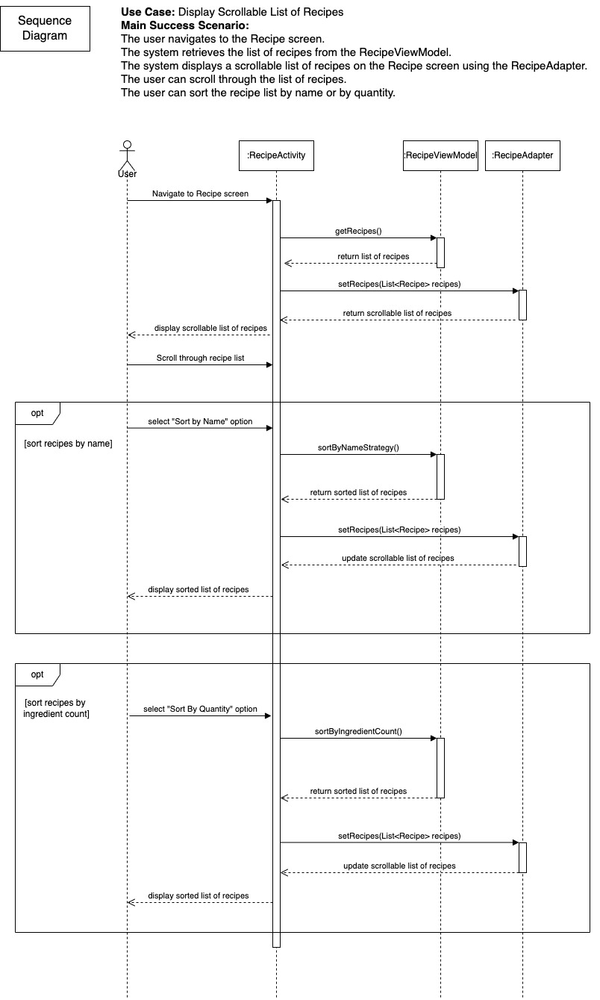
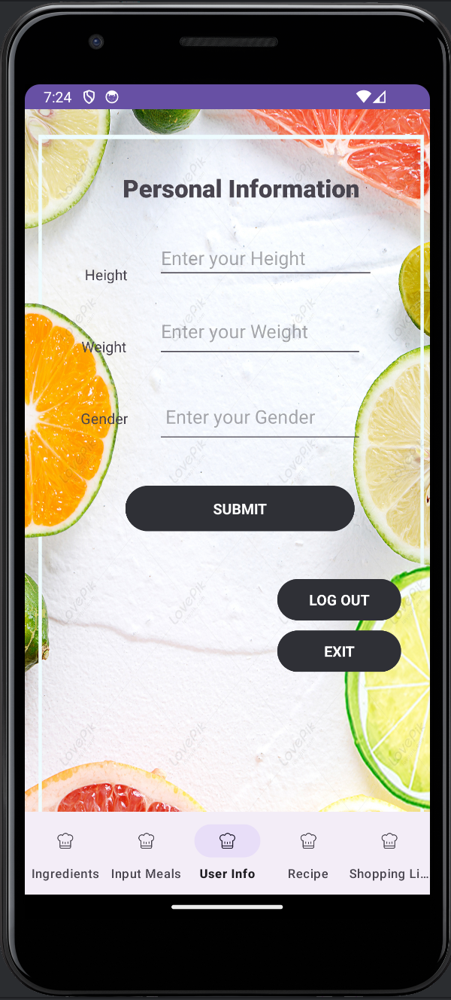
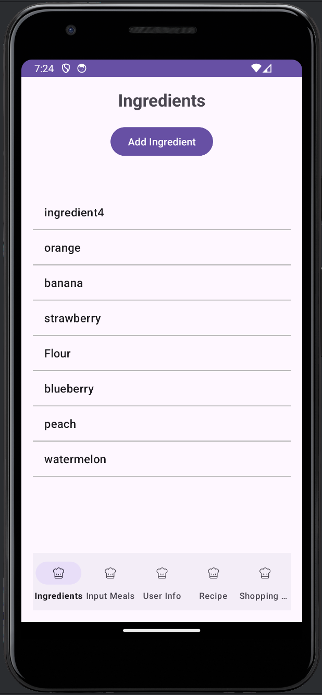
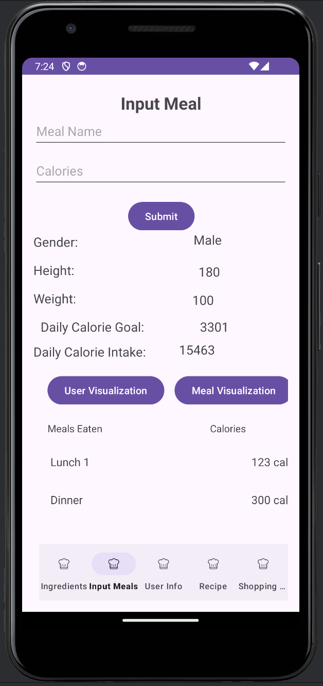
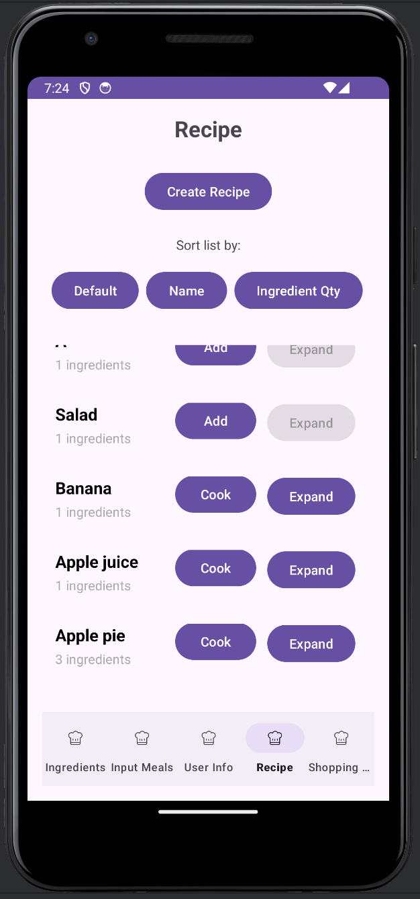
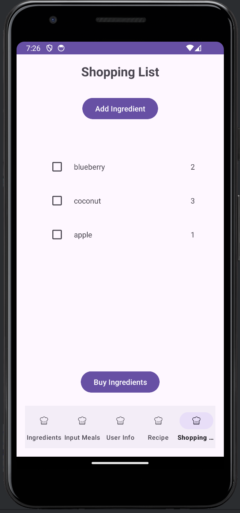

# GreenPlate: A Sustainable Food Management System

## Introduction

   Welcome to GreenPlate, an innovative project designed to revolutionize the way we think about and manage our food. At the heart of GreenPlate is our commitment to promoting sustainable food management. GreenPlate is not merely a tool; it's a movement towards a sustainable future, focusing on minimizing food waste and optimizing resource use. Our project aligns closely with contemporary needs to conserve and responsibly manage our environmental resources by integrating advanced, user-friendly technology into the daily lives of our users.
   
   At GreenPlate, we are dedicated to fostering sustainable eating and shopping habits, enabling users to contribute actively to environmental conservation. By offering functionalities like meal logging, recipe creation, and comprehensive shopping list management, GreenPlate addresses the core aspects of food sustainability. Our application helps users plan and manage their food resources more efficiently, ensuring that every meal is prepared thoughtfully and every purchase is made wisely.
   
   GreenPlate also serves as a platform for users to track their daily calorie intake while providing actionable insights into their food consumption patterns. This holistic approach not only aids in reducing food waste but also promotes healthier eating practices. With features that are intuitively designed to cater to the needs of the environmentally conscious gourmand, GreenPlate is pioneering a path to a greener planet, one meal at a time.
   
   This website is designed to showcase the various facets of the GreenPlate project, detailing the innovative features and the technologies employed. From our commitment to using robust design patterns that enhance scalability and maintainability, to our efforts in creating a user-centric interface, every element of GreenPlate is crafted with precision and purpose. Join us as we explore how GreenPlate is setting new standards in the domain of sustainable food management, making it an indispensable tool for anyone committed to a sustainable lifestyle.

## Design & Architecture

The architecture of GreenPlate is built on robust design principles and patterns that ensure scalability, maintainability, and efficiency. Below are the UML diagrams that provide a clear visual representation of the application's design:

- ***Use Case Scenario & Sequence Diagram***:

   
  
- ***Design class Diagram***: This design diagram details the structure of our classes, their interrelationships, and how they interact within the system.
  

We utilize a series of design patterns covered in the class. For instance, Singleton, Strategy Pattern and Observer patterns were used to manage object creation and ensure that the system uses resources optimally.

- **Singleton Design Pattern**:
  We implemented Singleton Pattern in the UserInfoViewModel and the InputMealViewModel as we only need 1 ViewModel for each of the UserInfoActivity and InputMeal activity. These activities used the getInstance() method to get the functions in the  viewmodels to work as desired. Each class has a static private instance variable, which holds an individual instance of the class. This variable is initially set to null. Also, each class has a private constructor that is responsible for initializing the instance. The constructor initializes the databaseReference with the Firebase in the case of both UserInfoViewModel and InputMealViewModel. The use of getInstance()  method creates access from other classes to get the instance of the ViewModel. It ensures that only one instance of each ViewModel class is created and used throughout our application, and it provides a controlled actress to the Firebase reference.
  
- **Strategy Design Pattern**:
  Our implementation of sortings align with the principles of the Strategy Pattern. We created a common interface RecipeSortingStrategy and individual classes for each sorting algorithm that implements RecipeSortingStrategy. We created the method setupSortingButtons， and called it within onCreate to initiate all buttons for sorting purposes. The  RecipeViewModel acts as the context, holding a reference to the functional interface that represents the chosen sorting behavior. This is exemplified in the methods in  RecipeViewModel. Sorting methods SortByDefault, SortByNameStrategy, SortByIngredientCount, each configuring the ViewModel to use a different sorting algorithm. This setup allows the sorting behavior to be changed dynamically, and it also ensures loose coupling in the implementation. The RecipeActivity interacts with the ViewModel by invoking these methods based on user input, extending the sorting methods of our application would not require changes to the RecipeViewModel or RecipeActivity.

- **Observer Design Pattern**:
In our application, we implemented the Observer pattern using LiveData within the Android framework. This pattern allows observing changes in the ViewModel without having direct dependencies. In our implementation, the ShoppingListViewModel acts as a subject holding observable LiveData objects. The ShoppingListActivity acts as an observer, updating the UI based on changes to these LiveData objects. This pattern reduces the complexity of managing UI updates, facilitates easier maintenance and testing, and improves the app's ability to handle changes in data state.

    

## User Interface (UI)

GreenPlate features a user-friendly interface that simplifies complex processes and enhances user engagement. Here's a visual tour of the app through various screenshots, showcasing the main functionalities and the interaction flow within the app:

1. **User Info Screen**:

   

   *The user info screen allows users to input their own information and logout or exit the application.*
   *User can enter height, weight and gender. After hitting the submit button, the user's information will be updated in the remote realtime database.*

3. **Ingredient Screen**:

   

   *Users can easily add, remove, and monitor food items in their pantry.*
   *Pressing hte "Add Ingredient" button will generate a dialog, where user can enter the ingredient name, quantity and calories for the ingredient. Hitting the submit button will store the user's ingredients into the database. All the ingredients will also be updated on the same screen, where user can click on the name, and modify the name, quantity and calories of the chosen ingredient.*

5. **Meal Screen**:
   
   

   *The meal screen keeps track of the meals that the user has consumed. It takes the info stored at the "User Info" screen and automatically computes the calorie goal of the user per day.*
   *User can click on the user visualization to compare the height and weight among all users, and meal visualization to see how much calories each meal takes with a line chart.*
   *User can enter the meal name and calories manually, and hit submit, to save the meal to the database, and the meal eaten will automatically show at the bottom of the screen within the scollable list. The meal visualization will also be updated upon clicking.*

   
7. **Recipe Screen**:
   
   

   *The recipe screen allows users to create recipes and access all other recipes created by other users.*
   *Hitting create recipe creates a dialog which user can press the add button and create a recipe with however many different ingredient the user wants. Upon saving, the recipe is saved to the database, and it will be updated on the same screen, where all user can see.*
   *There are two buttons beside each recipe, "add" and "expand". If the user does not have enough ingredient, the "expand" button cannot be clicked. Hitting the "add" button will automatically add ingredients to the shopping list. If the user has enough ingredients, the "add" button will turn into "cook" button, indicating that the user has enough ingredients. Now, user can expand to see the ingredients, or cook, which will consume all the ingredients in the pantry and adding the meal to the meal user eats today.*
   *Also, we provide two sorting methods for sorting the recipe based on the name, and how much ingredients the recipe requires.*

9. **Shoppinglist Screen**:
    
   

   *The shopping list screen allows users to create a shopping list and buy items.*
   *User can add a number of ingredients to the shopping list, which will be added to the shopping list database. Clicking the checkbox on the left will allow the user to select which ingredients to buy. The "Buy Ingredients" button, which functions the same as its name, buys the ingredients and add them to the database.*

## Functionality

For a deeper insight into how GreenPlate works, check out our video demonstration below. This video covers various features and showcases the real-time capabilities of the app:

## Conclusions and Reflections/Learning

Before embarking on this project, our team had no prior experience with Android Studio or Firebase. The development process spanned four intensive sprints and involved integrating several industry-standard principles and architectural patterns, including Strategy patterns, SOLID/GRASP principles, creating UML diagrams, and implementing the Model-View-ViewModel (MVVM) architecture.

Learning and applying these design principles and architectural frameworks significantly enhanced our technical skills and deepened our understanding of effective software development practices. The structured approach helped us to tackle complex challenges systematically and develop a robust, scalable application. Throughout the project, every team member had the opportunity to engage with both the front-end and back-end aspects of the system. This holistic exposure provided us with a comprehensive view of the software development world, enriching our capabilities and preparing us for future technological endeavors. The experience was transformative, broadening our perspective and fortifying our skills in software design and development.

## Contributors

Special thanks to all team members who contributed to the development of GreenPlate. Each individual’s effort was vital in bringing this project to fruition:

- **Yixiao Zhang**
- **Qingzhou Shen**
- **Yurun Zhu**
- **Sirui Lin**
- **Zihan Chen**
- **Trevor Goo**

Special mention to **Yixiao Zhang**, **Zihan Chen**, **Sirui Lin**, **Qingzhou Shen** and **Trevor Goo** who were instrumental in the website's deployment.

